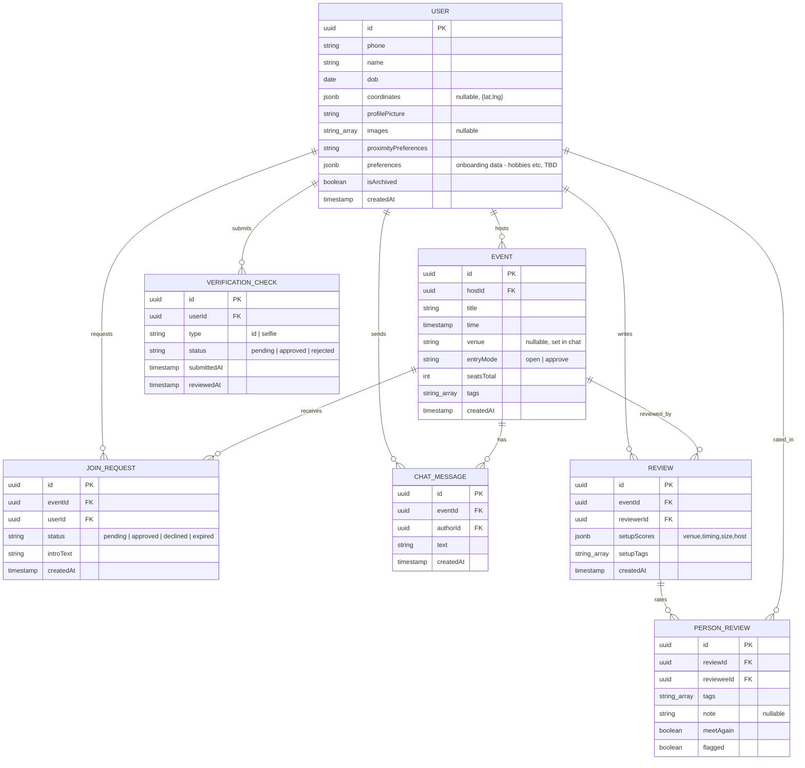

# Companion App — ER Diagram

Diagram only — no ORM/schema stub yet. Derived from the current mock data ([apps/mobile/src/data.ts](../apps/mobile/src/data.ts)) and reducer state ([apps/mobile/src/state.tsx](../apps/mobile/src/state.tsx)), turned into a normalized relational shape for future models in `apps/server`.

## Diagram

## Entities

### User
Replaces the hardcoded `host`/`hostInitials`/reviewer name strings scattered across mock data. `initials` dropped (derivable from `name`); tags (`upForTags`) deferred to a later pass.

| Field | Type | Source |
|---|---|---|
| id | uuid PK | — |
| phone | string | OTP signup (`Signup` screen) |
| name | string | `Activity.host`, `REVIEW_ATTENDEES[].name` |
| dob | date | new — not yet in mock data |
| coordinates | jsonb, nullable | new — not yet in mock data |
| profilePicture | string | new — not yet in mock data |
| images | text[], nullable | new — not yet in mock data |
| proximityPreferences | string | `RADIUS_OPTIONS` selection (was `radiusPref`) |
| preferences | jsonb | new — onboarding data (hobbies etc.), fields TBD |
| isArchived | boolean | new — not yet in mock data |
| createdAt | timestamp | — |

### VerificationCheck
Kept separate from User (not a flag on it) because it's a trust/safety audit trail — resubmissions and admin review need their own timeline.

| Field | Type | Source |
|---|---|---|
| id | uuid PK | — |
| userId | uuid FK → User | — |
| type | `id` \| `selfie` | `VERIFY_STEPS[].key` |
| status | `pending`\|`approved`\|`rejected` | `VERIFY_STEPS[].state` |
| submittedAt | timestamp | — |
| reviewedAt | timestamp, nullable | — |

### Event
Maps to `Activity`. `seatsFilled`/`going` are **derived** (count of `JoinRequest` rows with `status = 'approved'`), not stored columns. `shapeLabel` dropped too — derived from `seatsTotal` (`2` → duo, else table), not worth a column.

| Field | Type | Source |
|---|---|---|
| id | uuid PK | `Activity.id` |
| hostId | uuid FK → User | `Activity.host` |
| title | string | `Activity.title` |
| time | timestamp | `Activity.time`/`when` |
| venue | string, nullable | `Activity.where` (null until decided in chat) |
| entryMode | `open`\|`approve` | `Activity.entry` |
| seatsTotal | int | `Activity.seatsTotal` |
| tags | text[] | `Activity.tags` (`VIBE_TAGS` vocabulary) |
| createdAt | timestamp | — |

### JoinRequest
Merges `QUEUE_SEED` (host's approval queue) with the `requested` list in `state.tsx`. An approved row *is* the attendance record — no separate Attendance table.

| Field | Type | Source |
|---|---|---|
| id | uuid PK | `QueueRequest.id` |
| eventId | uuid FK → Event | — |
| userId | uuid FK → User | — |
| status | `pending`\|`approved`\|`declined`\|`expired` | `state.decided` (expired: new — not yet in mock data) |
| introText | string | `QueueRequest.intro` |
| createdAt | timestamp | — |

### ChatMessage
Maps directly to `ChatMessage`/`CHAT_SEED`.

| Field | Type | Source |
|---|---|---|
| id | uuid PK | `ChatMessage.id` |
| eventId | uuid FK → Event | — |
| authorId | uuid FK → User | `ChatMessage.author` |
| text | string | `ChatMessage.text` |
| createdAt | timestamp | — |

### Review
One row per reviewer per event. `setupScores` stored as jsonb (fixed 4-axis set from `SETUP_AXES` — not worth a separate table).

| Field | Type | Source |
|---|---|---|
| id | uuid PK | — |
| eventId | uuid FK → Event | — |
| reviewerId | uuid FK → User | — |
| setupScores | jsonb | `state.setupScores` (`SETUP_AXES` keys) |
| setupTags | text[] | `state.setupTags` (`SETUP_TAGS` vocabulary) |
| createdAt | timestamp | — |

### PersonReview
One row per attendee rated within a Review — genuinely relational since a reviewer rates multiple people per event.

| Field | Type | Source |
|---|---|---|
| id | uuid PK | — |
| reviewId | uuid FK → Review | — |
| revieweeId | uuid FK → User | `REVIEW_ATTENDEES[].id` |
| tags | text[] | `state.peopleTags[personId]` (`PEOPLE_TAGS` vocabulary) |
| note | string, nullable | new — not yet in mock data |
| meetAgain | boolean | `state.meetAgain[personId]` |
| flagged | boolean | `state.flagged[personId]` |

## Notes

- Tag vocabularies (`VIBE_TAGS`, `PEOPLE_TAGS`, `SETUP_TAGS`) are stored as native Postgres `text[]` columns, not a `Tag` join table — small fixed sets, not worth normalizing yet.
- `Profile` stats/history (`PROFILE_STATS`, `PROFILE_HISTORY`, `PROFILE_WORDS`, `PROFILE_HOST_SCORES`) are all **derived** from `Event`, `JoinRequest`, and `Review`/`PersonReview` — no dedicated table.
- ORM/schema choice deferred — build `schema.prisma` or TypeORM entities from this diagram when models are actually implemented in `apps/server`.
