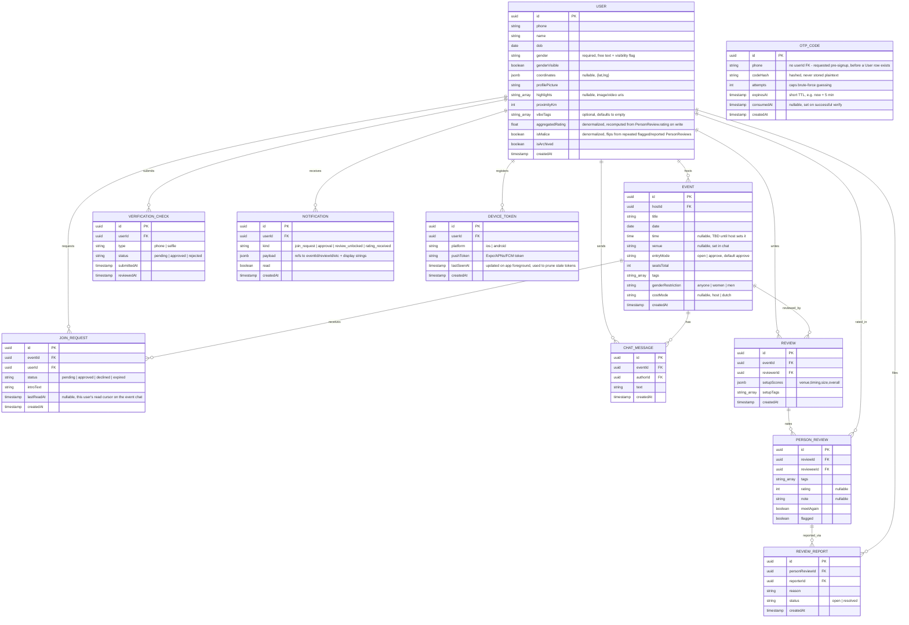

# Companion App — Data Layer Assessment & ER Diagram

Diagram only — no ORM/schema stub yet. Derived from the current mobile data layer
([apps/mobile/src/data/](../apps/mobile/src/data/)) and reducer state
([apps/mobile/src/store/](../apps/mobile/src/store/)), turned into a normalized
relational shape for future models in `apps/server`.

## Assessment of the current data layer

The mobile app has no backend — everything is either static seed arrays in
`src/data/*.ts` or client-only reducer state in `src/store/*/schema.ts`, persisted
(partially) to `AsyncStorage`. Reading it end to end as a workflow (Signup → Verify
→ Lock → Board → Detail/Create → Sent → Queue → Chat → Review → Filed):

- **Flat, denormalized seed shapes.** `Activity` (`data/activities.ts`) inlines the
  host as three redundant string fields (`host`, `hostFirst`, `hostInitials`) and
  `going: GoingPerson[]` inlines full attendee snapshots (name, gender, colors)
  instead of referencing a `User` by id. This is fine for hardcoded fixtures, wrong
  for a backend — it's the single biggest normalization gap.
- **State that is really persistence, mislabeled as UI state.** `plansStore`
  (published plans, join requests, host decisions), `chatStore` (messages),
  `reviewStore` (scores, tags, per-person ratings) are exactly the write paths a
  backend needs to serve — they map close to 1:1 onto the entities below. `authStore`
  and `onboardingStore` are the User/VerificationCheck write paths.
- **IDs are not real foreign keys yet.** `QueueRequest.id`, `Activity.id`, etc. are
  human-readable slugs (`'ramen'`, `'tobi'`) reused across arrays by convention, not
  enforced relations — swap to uuid PKs/FKs at the schema boundary.
- **New since the last pass:** `Notifications` (mocked inline in the screen, not in
  any store — needs a `NOTIFICATION` entity if it's to persist/scale past a demo),
  `ReportReview` (writes nowhere yet — needs a `REVIEW_REPORT` entity), `SearchFilters`
  (pure UI, reads existing tag/proximity vocab, no new entity).
- **Unread messages / push delivery have no home yet.** Nothing in the client tracks
  a read cursor for chat, and there's no device-token registration anywhere — both
  needed the moment chat/notifications must reach a backgrounded or killed app. Added
  `JoinRequest.lastReadAt` (read cursor) and a new `DEVICE_TOKEN` entity below.
- **OTPs are not stored anywhere.** `Signup.tsx` has no real send/verify call, and
  `VerificationCheck` only records that phone verification happened, not the code,
  its expiry, or attempt count. Added a new `OTP_CODE` entity below.
- **Derived values stored as fields.** `seatsFilled`/`going` on `Activity`,
  `joinedCountFor`/`isPlanArchived` on `PublishedPlan` are computed client-side from
  requester/decision lists — keep them **derived** in the backend too (view/query),
  never a stored column that can drift from the source rows.
- **Tag vocabularies** (`VIBE_TAGS`, `PEOPLE_TAGS`, `SETUP_TAGS`, `REPORT_REASONS`)
  are small fixed enums in `data/constants.ts` — stay as Postgres `text[]`/enum, not
  join tables, until they need admin-editable growth.

## Diagram

## Entities

### User
Replaces the hardcoded `host`/`hostInitials`/reviewer name strings scattered across
`data/activities.ts`, `data/people.ts`, `data/reviews.ts`. `initials` dropped
(derivable from `name`).

| Field | Type | Source |
|---|---|---|
| id | uuid PK | — |
| phone | string | `onboardingStore` (`SET_PHONE`) |
| name | string | `onboardingStore` (`SET_NAME`) |
| dob | date | `onboardingStore` (`SET_DOB`) |
| gender | string, required | `onboardingStore` (`SET_GENDER`/`SET_GENDER_CUSTOM`) |
| genderVisible | boolean | `onboardingStore` (`TOGGLE_GENDER_VISIBLE`) |
| coordinates | jsonb, nullable | new — not yet captured client-side |
| profilePicture | string, required | `onboardingStore` (`SET_PROFILE_PHOTO`) |
| highlights | text[], nullable | `onboardingStore` (`ADD_HIGHLIGHT`/`REMOVE_HIGHLIGHT`) |
| proximityKm | int | `authStore.proximityKm` (`SET_PROXIMITY`) |
| vibeTags | text[], optional, default `[]` | `onboardingStore` (`TOGGLE_VIBE_TAG`, `VIBE_TAGS` vocab) |
| aggregatedRating | float, default `0` | new — denormalized average of this user's `PersonReview.rating` rows, matches client's `myAverageRating()` but stored so Profile/MyReviews reads don't scan all reviews |
| isMalice | boolean, default `false` | new — denormalized trust/safety flag, set when a user accumulates enough `flagged` `PersonReview`s or upheld `ReviewReport`s |
| isArchived | boolean | new — not yet in mock data |
| createdAt | timestamp | — |

### VerificationCheck
Kept separate from User (not a flag on it) — a trust/safety audit trail;
resubmissions and admin review need their own timeline.

| Field | Type | Source |
|---|---|---|
| id | uuid PK | — |
| userId | uuid FK → User | — |
| type | `phone`\|`selfie` | `onboardingStore.selfieStatus`, `VERIFY_STEPS` |
| status | `pending`\|`approved`\|`rejected` | `VERIFY_STEPS[].state` |
| submittedAt | timestamp | — |
| reviewedAt | timestamp, nullable | — |

### Event
Maps to `Activity`. `seatsFilled`/`going`/`goingLine` are **derived** (count/list
of `JoinRequest` rows with `status = 'approved'`), not stored columns.
`shapeLabel`/`slot`/`dist`/`when`/`where`/`gettingIn` are display strings computed
from `seatsTotal`, `venue`, `time`, `entryMode` at read time — not worth columns.

| Field | Type | Source |
|---|---|---|
| id | uuid PK | `Activity.id` / `PublishedPlan.id` |
| hostId | uuid FK → User | `Activity.host` |
| title | string | `Activity.title` / `PublishedPlan.title` |
| date | date, required | `PublishedPlan.planDate` |
| time | time, nullable | `PublishedPlan.planTime` (`CLEAR_TIME` sets it back to null — a plan can have a date with no time decided yet) |
| venue | string, nullable | `Activity.where` / `PublishedPlan.venue` |
| entryMode | `open`\|`approve`, default `approve` | `Activity.entry` / `PublishedPlan.approvalRequired` (`plansStore` draft defaults `approvalRequired: true`) |
| seatsTotal | int | `Activity.seatsTotal` / `PublishedPlan.size` |
| tags | text[] | `Activity.tags` / `PublishedPlan.tags` |
| genderRestriction | `anyone`\|`women`\|`men` | `PublishedPlan.genderRestriction` |
| costMode | `host`\|`dutch`, nullable | `PublishedPlan.costMode` |
| createdAt | timestamp | `PublishedPlan.createdAt` |

### JoinRequest
Merges `QUEUE_SEED`/`REQUESTER_POOL` (host's approval queue) with
`plansStore.requested`/`decided`. An approved row *is* the attendance record — no
separate Attendance table.

| Field | Type | Source |
|---|---|---|
| id | uuid PK | `QueueRequest.id` |
| eventId | uuid FK → Event | `PublishedPlan.requesters` |
| userId | uuid FK → User | — |
| status | `pending`\|`approved`\|`declined`\|`expired` | `plansStore.decided` (expired: new) |
| introText | string | `QueueRequest.intro` |
| lastReadAt | timestamp, nullable | new — this user's read cursor for the event's chat; unread badge = `count(ChatMessage where eventId = this.eventId and createdAt > lastReadAt)` |
| createdAt | timestamp | — |

### ChatMessage
Maps directly to `ChatMessage`/`CHAT_SEED`. `chatStore.requesterMsgs` (pre-approval
DMs) become rows with a nullable `eventId` and a `dmWithUserId` instead — see
BE-er-todo for the exact shape.

| Field | Type | Source |
|---|---|---|
| id | uuid PK | `ChatMessage.id` |
| eventId | uuid FK → Event, nullable | — |
| authorId | uuid FK → User | `ChatMessage.author` |
| text | string | `ChatMessage.text` |
| createdAt | timestamp | — |

### Review
One row per reviewer per event. `setupScores` stored as jsonb (fixed 4-axis set
from `SETUP_AXES` — not worth a separate table).

| Field | Type | Source |
|---|---|---|
| id | uuid PK | — |
| eventId | uuid FK → Event | `reviewStore.setupScores`/`setupTags` keyed by planId |
| reviewerId | uuid FK → User | — |
| setupScores | jsonb | `reviewStore.setupScores[planId]` |
| setupTags | text[] | `reviewStore.setupTags[planId]` |
| createdAt | timestamp | — |

### PersonReview
One row per attendee rated within a Review — genuinely relational since a reviewer
rates multiple people per event.

| Field | Type | Source |
|---|---|---|
| id | uuid PK | — |
| reviewId | uuid FK → Review | — |
| revieweeId | uuid FK → User | requester id |
| tags | text[] | `reviewStore.peopleTags[personId]` |
| rating | int, nullable | `reviewStore.personRatings[personId]` |
| note | string, nullable | `reviewStore.personNotes[personId]` |
| meetAgain | boolean | `reviewStore.meetAgain[personId]` |
| flagged | boolean | `reviewStore.flagged[personId]` |

### ReviewReport
New — backs `ReportReview.tsx`, which today has no write path at all
(`REPORT_REASONS` picked but never submitted). Needed so a flagged/reported
review can be triaged.

| Field | Type | Source |
|---|---|---|
| id | uuid PK | — |
| personReviewId | uuid FK → PersonReview | the review being reported |
| reporterId | uuid FK → User | current user |
| reason | string | `REPORT_REASONS` vocab |
| status | `open`\|`resolved` | new |
| createdAt | timestamp | — |

### Notification
New — backs `Notifications.tsx`, which today hardcodes four rows in the screen
itself. `payload` carries the ids/strings needed to render the row (e.g.
`{eventId, actorName}`) without a join on read.

| Field | Type | Source |
|---|---|---|
| id | uuid PK | — |
| userId | uuid FK → User | recipient |
| kind | `join_request`\|`approval`\|`review_unlocked`\|`rating_received` | `Notifications.tsx` item shapes |
| payload | jsonb | — |
| read | boolean | "Mark all read" action |
| createdAt | timestamp | — |

`Notification` is the **in-app inbox** row (drives the bell/list screen and unread
badges). It is deliberately separate from `DeviceToken`/push delivery below — a
`Notification` row always gets written so the inbox has history even if push
delivery fails or the user has no token registered; whether a push is *also* sent
is a runtime decision (is the user's socket/SSE stream connected right now?), not a
schema concern. See [backend-system-design.md](./backend-system-design.md#realtime--push-delivery)
for the foreground/background delivery flow.

### DeviceToken
New — has no client counterpart yet (no push registration exists anywhere in the
app today). One row per device a user has logged in on; needed the moment any
notification (chat message, join request, approval) must reach a backgrounded or
killed app via APNs/FCM instead of the live socket/SSE stream.

| Field | Type | Source |
|---|---|---|
| id | uuid PK | — |
| userId | uuid FK → User | — |
| platform | `ios`\|`android` | new |
| pushToken | string | Expo push token obtained on login/app-open |
| lastSeenAt | timestamp | refreshed on app foreground; tokens unrefreshed past ~60 days are pruned |
| createdAt | timestamp | — |

### OtpCode
New — the actual OTP send/verify flow has no storage anywhere today (`Signup.tsx`
has no real send call; `VerificationCheck.type = 'phone'` only records that
verification happened, not the code itself). Keyed by `phone`, not a `User` FK,
because it's requested before a `User` row necessarily exists (first-time signup).
Not stored in Redis despite being ephemeral/TTL'd data — Approach A
([backend-system-design.md](./backend-system-design.md)) deliberately has no Redis;
plain Postgres with an indexed `expiresAt` is enough at this volume, and expired
rows are swept by the same cron sweep as `JoinRequest` expiry.

| Field | Type | Source |
|---|---|---|
| id | uuid PK | — |
| phone | string | `onboardingStore.phone` / OTP-send request |
| codeHash | string | new — hashed (bcrypt/argon2), never plaintext |
| attempts | int, default `0` | new — caps brute-force guesses on this code, independent of the send-endpoint rate limit |
| expiresAt | timestamp | new — short TTL (~5 min) |
| consumedAt | timestamp, nullable | new — set on successful verify; a consumed or expired code can't be reused |
| createdAt | timestamp | — |

## Notes

- Tag vocabularies (`VIBE_TAGS`, `PEOPLE_TAGS`, `SETUP_TAGS`, `REPORT_REASONS`) stay
  as native Postgres `text[]`/enum columns, not join tables — small fixed sets.
- `Profile`/`MyReviews` stats (`RATING_DIST`, `RATING_TRAITS`, `myAverageRating`)
  are all **derived** from `Event`, `JoinRequest`, and `Review`/`PersonReview` — no
  dedicated table.
- ORM/schema choice deferred to [BE-er-todo.md](./BE-er-todo.md) — that's where this
  diagram becomes an actual `schema.prisma`/DDL draft for `apps/server`.
